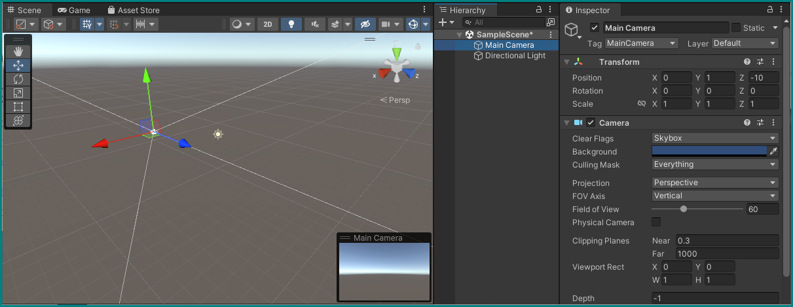

# First Unity Project — getting to know the Editors


<!--  -->

## Create a first project using the Unity Hub

If not already running on your computer, start the Unity Hub (see the icon above). Depending on previous use there may be already projects listed in its window — if so, disregard them for now and just click the __New project__ button.


You will be presented with a dialog to configure the project. Usually it's already all set up correctly, but to make sure just verify the following points:

+ __Editor Version__ should be the latest one from the list (2021.3.11f1 in our case),
+ The __3D__ *template* should be selected,
+ Don't forget to give your first project a name and choose a location (the default works here).


Pushing the __Create project__ button will open the *Unity Editor* and tell it create a new project with the above parameters. This may take some time…


## Setting up the Editor

Once this process is complete, you will see a the Unity Editor in its default configuration, showing a blank *scene.*


You can leave this as is, or drag the tab handles and section dividers around to create a more comfortable working environment. One particularly important change would be to permanently reveal the *Console* window by dragging the *Project* window it's being obscured by to a new location. Below is our suggested arrangement with new placements of the *Hierarchy,* *Project,* and *Console* windows.


The biggest part should show you the *__Scene__ View,* where you can freely navigate using common 3D software controls, like zooming in and out with the mouse wheel, rotating by holding the right mouse button, and translating your position by holding the middle mouse button. See the [official Unity manual](https://docs.unity3d.com/Manual/SceneViewNavigation.html) on more information on this.

## Scene, Hierarchy, and Camera Views + Inspector

The Scene View shows you the contents of your currently open *Scene* — a kind of super *Object* that holds all other objects. A full overview of all objects and their relationships is shown in the *__Hierarchy__ window* — as you can see, it currently only contains our only Scene (__SampleScene__), which holds a simple *Directional Light* for illuminating the world and the *Main Camera* that lets a player see it. Let's select that camera by clicking on it in the *Hierarchy* or on its *Gizmo* (camera icon) in the *Scene* view:



It is now highlighted in both *Scene* and *Hierarchy* views, as shown by a highlight and the appearance of arrows pointing in the cardinal directions around the object. In addition, a view from this camera now shows up in the Scene view as a floating window: this is what a player of this game will see if we run it. The same view is visible in a full window by selecting the *Game* tab in the Scene window.

Another thing that happens when we select a *Game Object* like this camera in the editor is the appearance of this object's *__Inspector__* in its previously empty window to the top right. This window allows us to view and change every single aspect of any Game Object, which may differ by their type. One *Component* all possible objects, be they cameras, lights, or dinosaur models share is their *Transform:* a grid that contains the coordinates of their position, rotation vector, and its scale.

??? info "Transforms and Hierarchies"
    In the case of the camera and light and any other objects directly under the __SampleScene__ Scene object, these coordinates are equivalent to their "world" coordinates. For any object that sits below another in the Hierarchy, these coordinates are basically offset by those of their *Parent.* See Unity's documentation on the [Hierarchy](https://docs.unity3d.com/Manual/Hierarchy.html) and [Transforms](https://docs.unity3d.com/Manual/class-Transform.html) for more details.

Let's set the camera's Position to the *origin* and rotate it to point in the blue arrow's (the Z-axis) direction by editing its Transform Component accordingly: set Position `X=0, Y=0, Z=0` and Rotation `X=0, Y=90, Z=0`.


## Creating a first object

Let's bring a cube into the scene.

While you can go to the main menu under *GameObject* and select what you want to create, a more precise way is to right-click on an empty part of the Hierarchy and selecting __3D Object → Cube__. This will create a basic cube [*GameObject*](https://docs.unity3d.com/ScriptReference/GameObject.html) inside our Scene, with a default Transform. If we had right-clicked on any existing object in the scene instead of on an empty space, we would have created a *child* object that would be tied to its *parent,* and this is not what we want in this case.


If you double-click on the new Cube object in the hierarchy, the scene view will fully zoom into it, showing that it basically swallowed our camera. If you select our camera object again, its view (or the Game View) won't show the cube — the way most 3D engines work, objects are transparent from the inside.


Let's move the box to a position where the camera can see it, and also try making it smaller by setting its transform component to Position `X=2, Y=0, Z=0` and Scale `X=0.2, Y=0.2, Z=0.2`.

Selecting our camera again, we can now see a small box appearing at the center of its view. If the cube is now gone from our scene view, just zoom out a bit, or double-click it again in the hierarchy.


You can keep playing around with the cube's Transform component to move it around and scale it, or also use the handles in the scene view: dragging one of the three arrows or the squares between them will also change the transform accordingly.

??? info "More on Positioning"
    There are many more ways to change the transform with the mouse. You can switch transform modes by pressing __W__, __E__, __R__, or by selecting the different icons in the little floating window in the scene view to move, rotate, scale an object, respectively. See the [Unity Documentation](https://docs.unity3d.com/Manual/PositioningGameObjects.html) for more details on this.


## A first animation

All we did so far is not much different than using any basic 3D creation software. Where a game engine like Unity differs, is its ability of freely *scripting* the objects we place in scenes, using programming languages.

### Creating a first script file

Let's try this out by making a script that will constantly rotate our cube. The easiest way to do this is by clicking the __Add Component__ button at the bottom of the cube's Inspector and just starting to type the name of the script we want to create in the search field, in this case let's name it `Rotating`. It will automatically understand that we want to create a new script, so select that option and then confirm by pressing __Create and Add__.


After a bit of waiting, the Unity editor will have created a new file inside its Assets folder, which you can see inside the *Project View* by clicking on the new Script component in the cube's Inspector.


### The newly created script — C#!

Double-clicking the Script field in the cube's Script component, or on the script's icon in the Project view will bring up a text editor (Visual Studio Code in this case, if everything is set up properly) with the script file, named `Rotating.cs` already opened. With the editor you can now make changes to the script! The Unity editor will take all changes into account every time you save your changes in the text editor and switch focus back to the Unity editor.

Every script you create using the above way will be a __*C#*__, or *C Sharp* script, as can be seen by its ".cs" ending. Unity will always create a new script file with a basic structure pre-written, looking like this:

``` csharp title="Rotating.cs"
using System.Collections;
using System.Collections.Generic;
using UnityEngine;

public class Rotating : MonoBehaviour
{
    // Start is called before the first frame update
    void Start()
    {
        
    }
    // Update is called once per frame
    void Update()
    {
        
    }
}
```

The first three lines (beginning with `using`) tell Unity which *Software Libraries* to load before executing any of the code, which allow it to access e.g. Unity's built-in functionalities and data types, or anything else you might want to include.

The next block, surrounded by the curly brackets `{ }` of `public class Rotating : MonoBehaviour` encompass all functionality of this script, in the simplest case. It tells Unity that this block defines a [`MonoBehavior` object](https://docs.unity3d.com/ScriptReference/MonoBehaviour.html), which is the kind of script object that one can attach to GameObjects in the Unity's hierarchy.

Within the curly brackets there are already the outlines of two standard functions that many scripts use: `void Start()` and `void Update()`. As already explained by the comments above them (any lines that start with `//` are disregarded by Unity and are only there for the programmer to read), the code within the curly brackets of `Start()` will be executed only once, at the very start of each run of the "game," while the contents of `Update()` will be called every time the screen refreshes. The empty round brackets `( )` following the names of these *functions* mean that they don't accept any input variables, and `void` before their names signifies that they don't output anything, either.

### Running the script

As all this code is still basically empty, running it won't change anything — you can try this by pressing the __Play__ button at the top middle of the Unity editor, which will *compile* any scripts you might have changed, switch to the Game view (the view of our main camera), and execute all scripts that are attached to GameObjects within the hierarchy.


As expected, the game view shows the main camera's perspective on a static cube. You can still access the cube's inspector by clicking on it in the hierarchy, where you can make changes to its transform by e.g. clicking and dragging the desired coordinates.

<!-- <div style='border-color: #018281; border-style: solid;'>
<div style='overflow: hidden; position:relative; margin-bottom:-223px; margin-top:-16px;padding-bottom:calc(70.80% + 33px); clip-path: inset(16px 0 223px 0)'> -->
<div style='border-color: #018281; border-style: solid;'>
<div style='overflow: hidden; position:relative; margin-top:-2.4%; margin-bottom:-33%;padding-bottom:calc(70.80% + 33px); clip-path: inset(3.3% 0 43.5% 0)'>
<iframe src='https://gfycat.com/ifr/fantasticflimsycuscus?controls=0&hd=1' frameborder='0' scrolling='no'' width='100%' height='100%' style='position:absolute;top:0;left:0;'></iframe>
</div></div>

Exiting the Play mode by again pressing the play button will reset any changes that we made in the hierarchy and inspector back to how they were before, and will again show the scene view by default.

### Editing the script — constant rotation around a fixed axis

Let's edit the `Rotating.cs` script so that it actually does something when the game runs.

What we want to happen is to change something about the cube's transform every time the screen refreshes. This can be accomplished by adding one line of code inside the given `void Update()` function, so that it looks like this:

``` csharp title="Rotating.cs"
void Update()
{
    transform.Rotate(Vector3.up, 30.0f * Time.deltaTime);
}
```

What this does it to call the `Rotate()` function of the GameObject's [`transform` component](https://docs.unity3d.com/ScriptReference/Transform.html) with the parameters `Vector3.up` for the rotation axis, and `30.0f * Time.deltaTime` for the rotation angle — for every frame that the game runs. If you type this yourself in the code editor instead of copying and pasting, you might see *code completion* kicking in, which offers suggestions and explanations of each of these *fields.*

`Vector3.up` is short for a [three-dimensional vector](https://docs.unity3d.com/ScriptReference/Vector3.html) that points straight up, and `Time.deltaTime` is the [time](https://docs.unity3d.com/ScriptReference/Time.html) that has passed since the last frame before the current one is called. `30.0f` is the simply a convention of writing `f`loating point numbers, as opposed to integers. If we save this script file, go back to Unity and hit the Play button, we will once again see the camera's view in the Game view, with the cube steadily rotating around its vertical axis, at 30 degrees per second.

<div style='border-color: #018281; border-style: solid;'>
<div style='overflow: hidden; position:relative; margin-top:-2.4%; margin-bottom:-33%;padding-bottom:calc(70.80% + 33px); clip-path: inset(3.3% 0 43.5% 0)'>
<iframe src='https://gfycat.com/ifr/coldsmallelver?controls=0&hd=1' frameborder='0' scrolling='no'' width='100%' height='100%' style='position:absolute;top:0;left:0;'></iframe>
</div></div>

### Making the script interactive

For now, this rotation is fixed — while you can still manually change the transform in the game view as above, the cube keeps rotating. You can try move it around or rotate it around the X or Z axes to see its automatic rotation change direction relative to the world, but staying constant relative to the cube.

To make the automatic rotation more interactive, we can edit our script to include variables, which need to be placed *outside* the `Update()` method, but still *within* the curly brackets of the `Rotating` *class.* Let's change these parts of the script to look like this:

``` csharp title="Rotating.cs"
public class Rotating : MonoBehaviour
{
    [Tooltip("Rotation angle per second")] public float speed = 30.0f;
    [Tooltip("Vector of the rotation axis")] public Vector3 axis = Vector3.up;

    // Update is called once per frame
    void Update() {
        transform.Rotate(axis, speed * Time.deltaTime);
    }
}
```

*Variables* are introduced by stating their *type* first, then their *name,* like `float speed` — a floating point number that we reference by the name "speed." If we want to make a variable accessible to scripts outside the its current *scope* (the Rotating MonoBehavior in this case), we need to prefix them with `public`. Like this we can also directly see their current value in the Unity's inspector, as parameters of the cube's script component.

It is often necessary, and usually a good practice to *initialize* new variables with a certain default value, which is assigned with the equals sign `=` and a following value. Here we can give them exactly what we had previously put in to the parameters for the `Rotate()` function: `30.0f` for `speed`, and `Vector3.up` for `axis`.

Finally, we need to replace the fixed values in the `transform.Rotate()` call with our new variables: `transform.Rotate(axis, speed * Time.deltaTime);` does that. Optionally, we can make these parameters that are now exposed in the inspector even more legible by adding the tooltips in the format shown above, before the `public` definitions of the variables.

Try it out: save the script, go back to the Unity editor, hit Play. You see the same rotation going on, but can now directly edit the rotation's parameters the same way you can interact with the cube's transform!

<div style='border-color: #018281; border-style: solid;'>
<div style='overflow: hidden; position:relative; margin-top:-2.4%; margin-bottom:-33%;padding-bottom:calc(70.80% + 33px); clip-path: inset(3.3% 0 43.5% 0)'>
<iframe src='https://gfycat.com/ifr/unitedcandidindianringneckparakeet?controls=0&hd=1' frameborder='0' scrolling='no'' width='100%' height='100%' style='position:absolute;top:0;left:0;'></iframe>
</div></div>

### Online/offline editing of values

Like before, changes in the inspector that happen while the game is running will be reverted to their default when you stop, but will stay if you make them while it's not running. If you change the axis or rotation speed while the game is off, the new values will override what you have as initial values in the code. If you go back to the code and put in new initial values and save, then these will overwrite anything currently set in the inspector.

!!! warning
    Always make sure that the game is __not playing__ while you make changes you want to __keep__, especially when adding/removing objects and components!

## A more complex animation

To practice more with animating an object, let's create a new script for the cube as we did before, by adding a new script component and naming it `Moving`. As before, we can keep the pre-build structure and just add to it.

With the new script, we want to move the cube between two specified points in space, at a certain speed. Let's add these variables to the `Moving` MonoBehavior, similar to how we did it above:

``` csharp title="Moving.cs"
public class Moving : MonoBehaviour
{
    [Tooltip("Units per second")] public float speed = 1.0f;    
    [Tooltip("Starting position in 3D space")] public Vector3 startPoint = new Vector3(2, 0, -1);
    [Tooltip("End position in 3D space")] public Vector3 endPoint = new Vector3(2, 0, 1);

    // Update is called once per frame
    void Update() {

    }
}
```

The main difference is how we're defining new Vectors now for `startPoint` and `endPoing`: we're initializing them with their coordinates. Save this code, and make sure that the this new component appears in the cube's inspector with the correct values we gave it in the code. If not, you can change the speed and points to their values right there.