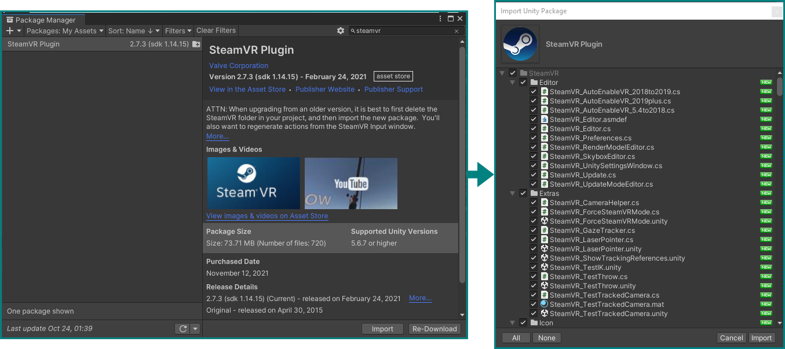

# Interaction in VR

Let's now dig into actually using VR with Unity, starting with basic interactions!

## Pre-flight inspection

For that we need to add some additional packages to Unity which will be specific to the hardware we're using for this tutorial — the *HTC Vive Pro Eye*, using *SteamVR.* You should verify the proper connection of the headset and the pairing of controllers by opening the Steam application and launching SteamVR. It may ask you to __Update Permissions__ on first launch — do it by allowing the changes.

If everything works, you can see the empty VR space and your controller(s) if you put on the headset, and in an optional desktop view of the VR environment you can enable from the menu button in the SteamVR window:

## A new project

Let's first of all create a new Unity 3D project with the hub, like before. You can close the one from the previous tutorial, we won't be needing it anymore. Set up the new project's window like we did for the first tutorial, or to your own liking.

??? info "Reusing the old project"
    You can also reuse your old project in this case, just delete __both__ the new objects and assets you created by right-clicking them in the hierarchy and project browser, respectively, and selecting "delete." Or you can also keep them around, as long they're deactivated in the hierarchy — it's up to you how much clutter you can tolerate vs. how much time you want to save. It can be good to have a working reference around to compare.

### Installing and importing Packages

In the Unity editor's menu bar, go to __Window → Package Manager__, which will open a new floating window. Selecting *My Assets* from the __Packages__ drop-down menu at the top, type in `steamvr` in the search box and you should have the *SteamVR Plugin* appear — import it with the __Import__ button below. A new window will present itself to let you select parts of the package, but we will just keep everything checked and hit __Import__ again.

??? info "The Asset Store"
    If SteamVR can not be found anywhere in the Package Manager, it may not be added yet to this Unity account. In that case go to the Unity Asset store, find it there, and add it to "your assets."

During this, some dialog boxes may appear — just confirm what they want. SteamVR may ask to accept changes to the project's settings — __Accept All__ and it will be very happy. You can close the package manager windows now.

Having the basics for VR installed with the SteamVR package, we now need an additional one for the eye tracker. You could [download it from the developer's website](https://developer.tobii.com/xr/develop/unity/getting-started/vive-pro-eye/#step-3-download-and-import-the-vive-sranipal-sdk), but we have already put it in a folder on your desktop.

To import a package (or an *asset*) that is not listed in the package manager, you need to go to __Assets → Import Package → Custom Package…__ in the menu bar. Navigate to the *packages* folder in the workshop folder and locate `Vive-SRanipal-Unity-Plugin.unitypackage` under `packages → SDK-v1.3.3.0 → SDK → 02_Unity`. Confirm with __Open__ and you'll be presented with the same interface as before to select only parts of it — again, keep all checked and __Import__.

## Adding VR basics

Now that we have the necessary packages all imported, we can add the bare necessities to our scene for VR to function.

### The Camera Rig

The SteamVR package includes everything we need to run VR in Unity, but to access the functionalities we need to add its assets to our scene/hierarchy. Specifically, we need the __CameraRig__ *Prefab*, which contains pre-configured objects that will correspond with the VR headset and controllers.

Add it by finding the `SteamVR` folder in the `Assets` folder with the Project browser. Inside that, there's a folder called `Prefabs`, which contains all its… [*Prefabs*](https://docs.unity3d.com/Manual/Prefabs.html), which are "GameObjects complete with all its components, property values, and child GameObjects as \[…\] reusable Asset\[s\]."

Locate the `[CameraRig]` prefab, and simply drag it to an empty are in the hierarchy:

<iframe src='https://gfycat.com/ifr/leadingdensejapanesebeetle?controls=0&hd=1' frameborder='0' scrolling='no'' width='100%' height='100%' style='position:absolute;top:0;left:0;'></iframe>

Being a prefab, it will appear blue in the hierarchy. Inside it you can find objects named `Controller (left)`, `Controller (right)`, and `Camera` if you expand it by clicking the arrow next to `[CameraRig]`. This new Camera object will be our main camera from now on, so you can delete the old, default `Main Camera` object from the hierarchy.

### First VR run

You can already try running the game to see an empty Unity world in VR. The first time you do, a SteamVR window will appear and ask you to "open the SteamVR Input window" to generate "actions for SteamVR" — do it. Click through this and the next window with __Yes__, and hit __Save and generate__ in the new SteamVR Input window that appears in Unity to generate the default inputs bindings for controls; you can close this window afterwards.

You may see some error messages in the console because these actions were missing — run the game again and they should be gone. The headset should be functioning and showing you an empty, sunny world!

## Interacting with objects in VR

Nice as that may be, we want more. Let's add some objects to interact with.

### Adding objects

Stop the game and start by adding a floor.

As before with the cube, right-click somewhere in the hierarchy, select `3D Object`, and then find `Plane`. This will create a flat surface in the middle of our environment. Make sure it's at the origin (Position: `X=0, Y=0, Z=0`) and not rotated, and adjust its scale to `X=0.5, Y=1, Z=0.5`.

Add a __cylinder__ the same way and place it at `X=1.2, Y=0.55, Z=0.5` with a scale of `0.5, 0.5, 0.5`.

Create a new __cube__ and scale it to `0.15, 0.15, 0.15`. Copy it by right-clicking on it and selecting `Duplicate` — the new one will automatically be named `Cube (1)`, which you can keep or rename to your liking, e.g. `Left Cube` and `Right Cube`.

### Tying objects to VR controllers

Now we want these two cubes to follow the movement of our VR controllers. The easiest way to do this is to simply drag them in the hierarchy to their respective controller objects in the CameraRig, making sure that they end up "inside" them:

<iframe src='https://gfycat.com/ifr/plumpdistantgull?controls=0&hd=1' frameborder='0' scrolling='no'' width='100%' height='100%' style='position:absolute;top:0;left:0;'></iframe>

Running the game now you should have a clumsy, white box surrounding the tips of your controllers, with a cylinder standing close by. If you want, you can adjust the transforms of each cube to offset them from the controllers: `0.15` on the Z-axis should look good enough.

### Materials and colors

Let's spice this blank world up a bit by adding some color.

Create new folder inside the Assets in the project browser by right-clicking the Assets folder, then __Create → Folder__. Name it `Materials`.

Inside this folder, create two new [*Materials*](https://docs.unity3d.com/Manual/Materials.html): __Create → Material__. Name them `BlueBox` and `RedBox`. Clicking on them you see their properties in the inspector — change the *Albedo* of BlueBox to a blue color, and that of RedBox to a red one by clicking on the white strip. You can see the changes in the preview sphere at the bottom of a material's inspector.

You can now assign these materials to the cubes by going to each cube's inspector, expanding the `Materials` property in its `Mesh Renderer` component, and either dragging a material there, or selecting one by clicking the target icon. Choose which cube should be red, and which blue, and make these changes.

### Rigidbody Components

While you can now wave around with colorful boxes, there is not much else going on — the cylinder just stands there, oblivious to anything you do (try it, the cubes and controllers will just intersect it in a ghostly fashion). We can change that by giving the objects in our scene [*Rigidbody*](https://docs.unity3d.com/Manual/class-Rigidbody.html) components, which will add physics and automatic collision detection to them.

In the hierarchy, select our smaller objects (the cylinder and both cubes) by holding CTRL and clicking on each. The inspector now shows properties that are shared for all objects, and allows you to add components in bulk.

Click __Add Component__ with all three objects (and nothing else!) selected, and search for the `Ridgidbody` component.

We want our cubes to still only be controlled by being tied to our controllers and not be affected by gravity, so go to the hierarchy, *de*select the cylinder and select only the two cubes. In their Rigidbody component, uncheck `Use Gravity` and place a checkmark on `Is Kinematic`.

The cylinder on the other hand should behave as a real physical object, so do the inverse for it: make sure `Use Gravity` is on, and `Is Kinematic` is off.

Run the game and observe the changes: the cylinder should now sit flush on the floor, and you can now use the cubes attached to your controllers to whack it! Hit hard enough and it falls off the floor plane and down to the endless abyss.

