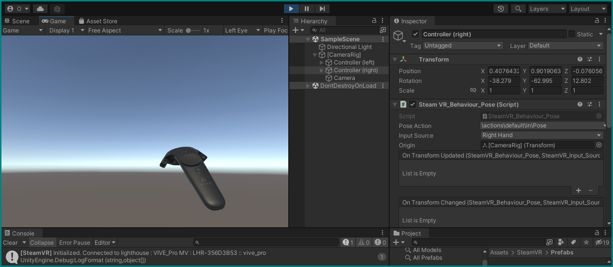

# Interaction in VR

Let's now dig into actually using VR with Unity, starting with basic interactions!

## Pre-flight inspection

For that we need to add some additional packages to Unity which will be specific to the hardware we're using for this tutorial — the *HTC Vive Pro Eye*, using *SteamVR.* You should verify the proper connection of the headset and the pairing of controllers by opening the Steam application and launching SteamVR. It may ask you to __Update Permissions__ on first launch — do it by allowing the changes.

If everything works, you can see the empty VR space and your controller(s) if you put on the headset, and in an optional desktop view of the VR environment you can enable from the menu button in the SteamVR window:


## A new project

Let's first of all create a new Unity 3D project with the hub, like before. You can close the one from the previous tutorial, we won't be needing it anymore. Set up the new project's window like we did for the first tutorial, or to your own liking.

??? info "Reusing the old project"
    You can also reuse your old project in this case, just delete __both__ the new objects and assets you created by right-clicking them in the hierarchy and project browser, respectively, and selecting "delete." Or you can also keep them around, as long they're deactivated in the hierarchy — it's up to you how much clutter you can tolerate vs. how much time you want to save. It can be good to have a working reference around to compare.

### Installing and importing Packages

In the Unity editor's menu bar, go to __Window → Package Manager__, which will open a new floating window. Selecting *My Assets* from the __Packages__ drop-down menu at the top, type in `steamvr` in the search box and you should have the *SteamVR Plugin* appear — import it with the __Import__ button below. A new window will present itself to let you select parts of the package, but we will just keep everything checked and hit __Import__ again.

??? info "The Asset Store"
    If SteamVR can not be found anywhere in the Package Manager, it may not be added yet to this Unity account. In that case go to the Unity Asset store, find it there, and add it to "your assets."


During this, some dialog boxes may appear — just confirm what they want. SteamVR may ask to accept changes to the project's settings — __Accept All__ and it will be very happy. You can close the package manager windows now.

Having the basics for VR installed with the SteamVR package, we now need an additional one for the eye tracker. You could [download it from the developer's website](https://developer.tobii.com/xr/develop/unity/getting-started/vive-pro-eye/#step-3-download-and-import-the-vive-sranipal-sdk), but we have already put it in a folder on your desktop.

To import a package (or an *asset*) that is not listed in the package manager, you need to go to __Assets → Import Package → Custom Package…__ in the menu bar. Navigate to the *packages* folder in the workshop folder and locate `Vive-SRanipal-Unity-Plugin.unitypackage` under `packages → SDK-v1.3.3.0 → SDK → 02_Unity`. Confirm with __Open__ and you'll be presented with the same interface as before to select only parts of it — again, keep all checked and __Import__.


## Adding VR basics

Now that we have the necessary packages all imported, we can add the bare necessities to our scene for VR to function.

### The Camera Rig

The SteamVR package includes everything we need to run VR in Unity, but to access the functionalities we need to add its assets to our scene/hierarchy. Specifically, we need the __CameraRig__ *Prefab*, which contains pre-configured objects that will correspond with the VR headset and controllers.

Add it by finding the `SteamVR` folder in the `Assets` folder with the Project browser. Inside that, there's a folder called `Prefabs`, which contains all its… [*Prefabs*](https://docs.unity3d.com/Manual/Prefabs.html), which are "GameObjects complete with all its components, property values, and child GameObjects as \[…\] reusable Asset\[s\]."

Locate the `[CameraRig]` prefab, and simply drag it to an empty are in the hierarchy:

<div style='border-color: #018281; border-style: solid;'>
<div style='overflow: hidden; position:relative; margin-top:-5%; margin-bottom:-10%;padding-bottom:calc(70.80% + 33px); clip-path: inset(6.7% 0 13% 0)'>
<iframe src='https://gfycat.com/ifr/leadingdensejapanesebeetle?controls=0&hd=1' frameborder='0' scrolling='no'' width='100%' height='100%' style='position:absolute;top:0;left:0;'></iframe>
</div></div>

Being a prefab, it will appear blue in the hierarchy. Inside it you can find objects named `Controller (left)`, `Controller (right)`, and `Camera` if you expand it by clicking the arrow next to `[CameraRig]`. This new Camera object will be our main camera from now on, so you can delete the old, default `Main Camera` object from the hierarchy.


### First VR run

You can already try running the game to see an empty Unity world in VR. The first time you do, a SteamVR window will appear and ask you to "open the SteamVR Input window" to generate "actions for SteamVR" — do it. Click through this and the next window with __Yes__, and hit __Save and generate__ in the new SteamVR Input window that appears in Unity to generate the default inputs bindings for controls; you can close this window afterwards.

You may see some error messages in the console because these actions were missing — run the game again and they should be gone. The headset should be functioning and showing you an empty, sunny world!



## Interacting with objects — Part 1

Nice as that may be, we want more. Let's add some objects to interact with.

### Adding objects

Stop the game and start by adding a floor.

As before with the cube, right-click somewhere in the hierarchy, select `3D Object`, and then find `Plane`. This will create a flat surface in the middle of our environment. Make sure it's at the origin (Position: `X=0, Y=0, Z=0`) and not rotated, and adjust its scale to `X=0.5, Y=1, Z=0.5`.

Add a __cylinder__ the same way and place it at `X=1.2, Y=0.55, Z=0.5` with a scale of `0.5, 0.5, 0.5`.

Create a new __cube__ and scale it to `0.15, 0.15, 0.15`. Copy it by right-clicking on it and selecting `Duplicate` — the new one will automatically be named `Cube (1)`, which you can keep or rename to your liking, e.g. `Left Cube` and `Right Cube`.

### Tying objects to VR controllers

Now we want these two cubes to follow the movement of our VR controllers. The easiest way to do this is to simply drag them in the hierarchy to their respective controller objects in the CameraRig, making sure that they end up "inside" them:

<div style='border-color: #018281; border-style: solid;'>
<div style='overflow: hidden; position:relative; margin-top:-5.1%; margin-bottom:-34%;padding-bottom:calc(70.80% + 33px); clip-path: inset(6.7% 0 45% 0)'>
<iframe src='https://gfycat.com/ifr/plumpdistantgull?controls=0&hd=1' frameborder='0' scrolling='no'' width='100%' height='100%' style='position:absolute;top:0;left:0;'></iframe>
</div></div>

Running the game now you should have a clumsy, white box surrounding the tips of your controllers, with a cylinder standing close by. If you want, you can adjust the transforms of each cube to offset them from the controllers: `0.15` on the Z-axis should look good enough.


### Materials and colors

Let's spice this blank world up a bit by adding some color.

Create new folder inside the Assets in the project browser by right-clicking the Assets folder, then __Create → Folder__. Name it `Materials`.

Inside this folder, create two new [*Materials*](https://docs.unity3d.com/Manual/Materials.html): __Create → Material__. Name them `BlueBox` and `RedBox`. Clicking on them you see their properties in the inspector — change the *Albedo* of BlueBox to a blue color, and that of RedBox to a red one by clicking on the white strip. You can see the changes in the preview sphere at the bottom of a material's inspector.


You can now assign these materials to the cubes by going to each cube's inspector, expanding the `Materials` property in its `Mesh Renderer` component, and either dragging a material there, or selecting one by clicking the target icon. Choose which cube should be red, and which blue, and make these changes.


### Rigidbody Components

While you can now wave around with colorful boxes, there is not much else going on — the cylinder just stands there, oblivious to anything you do (try it, the cubes and controllers will just intersect it in a ghostly fashion). We can change that by giving the objects in our scene [*Rigidbody*](https://docs.unity3d.com/Manual/class-Rigidbody.html) components, which will add physics and automatic collision detection to them.

In the hierarchy, select our smaller objects (the cylinder and both cubes) by holding CTRL and clicking on each. The inspector now shows properties that are shared for all objects, and allows you to add components in bulk.

Click __Add Component__ with all three objects (and nothing else!) selected, and search for the `Ridgidbody` component.


We want our cubes to still only be controlled by being tied to our controllers and not be affected by gravity, so go to the hierarchy, *de*select the cylinder and select only the two cubes. In their Rigidbody component, uncheck `Use Gravity` and place a checkmark on `Is Kinematic`.

The cylinder on the other hand should behave as a real physical object, so do the inverse for it: make sure `Use Gravity` is on, and `Is Kinematic` is off.

Run the game and observe the changes: the cylinder should now sit flush on the floor, and you can now use the cubes attached to your controllers to whack it! Hit hard enough and it falls off the floor plane and down to the endless abyss.

<div style='border-color: #018281; border-style: solid;'>
<div style='overflow: hidden; margin-top:-5.1%; margin-bottom:-34%; position:relative; padding-bottom:calc(70.80% + 33px); clip-path: inset(6.7% 0 45% 0)'>
<iframe src='https://gfycat.com/ifr/shoddyunlinedkingfisher?controls=0&hd=1' frameborder='0' scrolling='no'' width='100%' height='100%' style='position:absolute;top:0;left:0;'></iframe>
</div></div>

## Interacting with objects — Part 2

### Other uses of Rigidbody

Sending objects flying is fun, but there are other uses of the Rigidbody component. As mentioned before, there is [collision detection](https://docs.unity3d.com/Manual/collision-section.html). It relies on there being a *Collider* component present in both objects, and a Rigidbody in at least one of them. We now need to configure this.

Let's be more gentle to the cylinder and remove its Rigidbody component by clicking on its three dots and selecting __Remove Component__. Make sure it still as its *Capsule Collider* component.

Select the two cubes again and inspect their *Box Collider* components and set a checkmark in the field `Is Trigger`. We can now be informed about collisions between our cubes and the cylinder in code.

### An array of Materials

Create another new folder within Assets, and name it Scripts.

In it, create a new `C# Script` called `SwitchMaterialOnCollide`. We want this script to give our cylinder a number of materials that it will switch between whenever a collision is detected.

Open the script in the code editor, and add some lines to create a public and a private variable:

```csharp title="SwitchMaterialOnCollide.cs" hl_lines="3 4"
public class SwitchMaterialOnCollide : MonoBehaviour
{
    public Material[] materials;
    private MeshRenderer _meshRenderer;
}
```

The variable `Material` is an [*Array*](https://docs.unity3d.com/2020.1/Documentation/ScriptReference/Array.html), which is set by placing two square brackets right after the variable name declaration. This means it is actually a *container* of multiple materials, the number of which is not set.

Save the code file and go back to the Unity editor to attach this code as a component to the cylinder by just dragging the file's icon from the project browser onto the cylinder object in the hierarchy.

You will now see the a `Switch Material On Collide` component in the cylinder's inspector, showing only `Materials` as an editable field — the second variable, `_meshRenderer`, is private and not visible here.

Expand this field with its arrow, and add increase the number of *Elements* this array of materials can hold by either entering `2` directly where there is currently a `0`, or by clicking the `+` button twice. You can now place our red and blue materials in these fields:

<div style='border-color: #018281; border-style: solid;'>
<div style='overflow: hidden; position:relative; margin-top:-5%; margin-bottom:-10%;padding-bottom:calc(70.80% + 33px); clip-path: inset(6.7% 0 13% 0)'>
<iframe src='https://gfycat.com/ifr/scentedhelpfulamericanredsquirrel?controls=0&hd=1' frameborder='0' scrolling='no'' width='100%' height='100%' style='position:absolute;top:0;left:0;'></iframe>
</div></div>

### MeshRenderer and its Material

Go back to the code editor and add two lines to the `Start()` function:

```csharp title="SwitchMaterialOnCollide.cs" hl_lines="11 12"
using UnityEngine;

public class SwitchMaterialOnCollide : MonoBehaviour
{
    public Material[] materials;
    private MeshRenderer _meshRenderer;
    
    // Start is called before the first frame update
    void Start()
    {
        _meshRenderer = GetComponent<MeshRenderer>();
        _meshRenderer.material = materials[0];
    }
}
```

Here, we assign the `_meshRenderer` variable declared above with the `MeshRenderer` component that's already attached to the cylinder. This works because the `SwitchMaterialOnCollide` script is attached to the cylinder object, and the `GetComponent<MeshRenderer>()` function searches through all components of the current GameObject and *returns* the first one that is of the type `MeshRenderer`. You can find this very component in the cylinder's inspector.

As its name implies, the MeshRenderer is the component of a GameObject that's responsible to *render* its mesh, i.e., making the its geometric shape visible on screen. Among its many parameters is the Material it uses, which is always set to *Default-Material* for any new 3D object you create.

The second line in our `Start()` function — `_meshRenderer.material = materials[0];` now reassigns this default value to whatever we've put in the first place (at index `0`) of our `materials[]` array of the *Switch Material On Collide* component every time we start the game. In the video above that would be the BlueBox material.

Try it out: the cylinder should now be blue when you run the game! It will revert back to the white Default Material when you stop the game.

<div style='border-color: #018281; border-style: solid;'>
<div style='overflow: hidden; margin-top:-5.1%; margin-bottom:-34%; position:relative; padding-bottom:calc(70.80% + 33px); clip-path: inset(6.7% 0 45% 0)'>
<iframe src='https://gfycat.com/ifr/assuredsilverdassierat?controls=0&hd=1' frameborder='0' scrolling='no'' width='100%' height='100%' style='position:absolute;top:0;left:0;'></iframe>
</div></div>


### Collision triggers

Now let's have the cylinder change its material not just on startup, but when we "physically" interact with it in VR. Add two new functions to our `SwitchMaterialOnCollide` script (outside the scope of `Start()`, but still inside the `MonoBehavior`):

```csharp title="SwitchMaterialOnCollide.cs" hl_lines="15 16 17 18 20 21 22 23"
using UnityEngine;

public class SwitchMaterialOnCollide : MonoBehaviour
{
    public Material[] materials;
    private MeshRenderer _meshRenderer;
    
    // Start is called before the first frame update
    void Start()
    {
        _meshRenderer = GetComponent<MeshRenderer>();
        _meshRenderer.material = materials[0];
    }

    private void OnTriggerEnter(Collider other)
    {
        _meshRenderer.material = materials[1];
    }

    private void OnTriggerExit(Collider other)
    {
        _meshRenderer.material = materials[0];
    }
}
```

The functions `OnTriggerEnter()` and `OnTriggerLeave()` are called when their GameObject *collides* with another one that has a Rigidbody attached, and a *collider* which is set to be a *Trigger* — we already did this with our cubes [above](#other-uses-of-rigidbody).

Run the game now and you can change the cylinder's material when you hit them with any of the cubes!

<div style='border-color: #018281; border-style: solid;'>
<div style='overflow: hidden; margin-top:-5.1%; margin-bottom:-34%; position:relative; padding-bottom:calc(70.80% + 33px); clip-path: inset(6.7% 0 45% 0)'>
<iframe src='https://gfycat.com/ifr/infantiledensejay?controls=0&hd=1' frameborder='0' scrolling='no'' width='100%' height='100%' style='position:absolute;top:0;left:0;'></iframe>
</div></div>

### Switching colors of a material

For now we've just switched between different materials to change the color of the cylinder, which could be considered wasteful. Why create a whole new material asset, when all we want to do is just change the color?

Create a new script called `SwitchColorOnCollide` and attach it to the cylinder. Remove the old Switch Material On Collide component from it.

```csharp title="SwitchColorOnCollide.cs"
using UnityEngine;

public class SwitchColorOnCollide : MonoBehaviour
{
    public Color[] colors;
    private Material _material;

    // Start is called before the first frame update
    void Start()
    {
        _material = GetComponent<MeshRenderer>().material;
        _material.color = colors[0];
    }

    private void OnTriggerEnter(Collider other)
    {
        _material.color = colors[1];
    }

    private void OnTriggerExit(Collider other)
    {
        _material.color = colors[0];
    }
}
```

The basic structure is the same as in `SwitchMaterialOnCollide.cs`, but note the differences:

+ We now store an array of [*Colors*](https://docs.unity3d.com/2020.1/Documentation/ScriptReference/Color.html) in the variable `colors`
* We get the *Material* from the cylinder's MeshRenderer by calling `.material` on the output of the `GetComponent<>()` function
* We assign one of our stored colors to the MeshRenderer's material

You can now directly set two different colors in the new Switch Material On Collide component (after you've saved the code), the [same way we input colors for the two box materials](#materials-and-colors).

Run the game again and see how the cylinder now changes its default material's colors to our choice:

<div style='border-color: #018281; border-style: solid;'>
<div style='overflow: hidden; margin-top:-5.1%; margin-bottom:-34%; position:relative; padding-bottom:calc(70.80% + 33px); clip-path: inset(6.7% 0 45% 0)'>
<iframe src='https://gfycat.com/ifr/separateexcitableeland?controls=0&hd=1' frameborder='0' scrolling='no'' width='100%' height='100%' style='position:absolute;top:0;left:0;'></iframe>
</div></div>

Once again, all changes to the default material will be reverted once we end the game.

!!! example "Challenge — do it yourself!"
    Create two new *Sphere* 3D objects and [attach these to the controllers](#tying-objects-to-vr-controllers) instead of the cubes, which you can remove. Give them the same functionalities as the cubes (Rigidbodies and Colliders with the same parameters).

    Shape and place them using their Transforms to roughly overlap with the controllers: you can do this while the game is running to see your changes, and once you have good values write them down to make them permanent outside of the game. You can copy one component's values to another by clicking its three-dot menu and selecing Copy or Paste.

    Once this works, try disabling the spheres' `Sphere (Mesh Filter)` and `Mesh Renderer` components: you will not see the spheres anymore, but they will still work in changing the colors of the cylinder!

## Interacting with objects — Part 3

For this last part of object interaction (for now), let's use something other than just the controllers' position to interact with the world. Maybe you've already noticed, but there are a lot of buttons on them — why not try them?

### Inter-script interaction

Let's first add another function to our `SwitchColorOnCollide` script:

```csharp title="SwitchColorOnCollide.cs" hl_lines="26 27 28 29 30 31"
using UnityEngine;

public class SwitchColorOnCollide : MonoBehaviour
{
    public Color[] colors;
    private Material _material;

    // Start is called before the first frame update
    void Start()
    {
        _material = GetComponent<MeshRenderer>().material;
        _material.color = colors[0];
    }

    private void OnTriggerEnter(Collider other)
    {
        _material.color = colors[1];
    }

    private void OnTriggerExit(Collider other)
    {
        _material.color = colors[0];
    }

    public void SetColor(int index)
    {
        if (index < 0 || index >= colors.Length) { return; }
        
        _material.color = colors[index];
    }
}
```

Being `public`, the `SetColor()` function can be called by other outside scripts. In addition, it takes an input parameter `(int index)`, an *integer* which it uses to select a color from our array of colors to assign to the main material.

The line `#!csharp if (index < 0 || index >= colors.Length) { return; }` is actually three lines shortened to one: an `if()` statement that checks whether the given index is smaller than zero or larger than our array of colors; if so: do nothing and escape this function `{return; }`. This is to prevent anything from going wrong if an external script gives it the wrong input — very important!

Save the file.

### SteamVR Actions

Let's now write a script that will call this public function. Create a new one named `ControllerInput` and attach it to the \[CameraRig\] GameObject:


```csharp title="ControllerInput.cs" hl_lines="2"
using UnityEngine;
using Valve.VR;

public class ControllerInput : MonoBehaviour
{
    public SteamVR_Action_Boolean Trigger;
    public SwitchColorOnCollide switchColorOnCollide; 

    // Update is called once per frame
    void Update()
    {
        if (Trigger.state)
        {
            switchColorOnCollide.SetColor(1);
        }
        else
        {
            switchColorOnCollide.SetColor(0);
        }
    }
}
```

We have now also added a new Library to use: `Valve.VR`, which gives us access to specific functions for our VR devices, such as the `SteamVR_Action_Boolean` class. We Create a variable `Trigger` that will listen to *actions* from our VR hardware, in this case `Boolean`-type events (on or off).

Since our previously created `SwitchColorOnCollide` script is a `public class`, we can also reference its definition here and create a variable of its class, which we call (lowercase) `switchColorOnCollide`.

In the `Update()` loop (every frame) we now want to check the `Trigger`'s `state`: if it's true, we tell our `switchColorOnCollide` object to set its color to the one it has at index `1`, and if it's false, to the one at index `0`. Take a moment to understand this, and feel free to ask if you have questions.

Save the script and return to Unity. As it is, it will not do anything: neither its *Trigger* or its *Switch Color On Collide* parameters are assigned yet. Fix this by giving the Trigger a default value from the SteamVR SDK (`\actions\default\in\InteractUI`), and the put the cylinder's *Switch Color On Collide* component in the second field. You can do this by searching for it among the objects in the current scene by clicking the target icon, or by simply dragging the whole cylinder object into it — it's smart enough to only take the relevant component from the cylinder.

<div style='border-color: #018281; border-style: solid;'>
<div style='overflow: hidden; margin-top:-5.1%; margin-bottom:-34%; position:relative; padding-bottom:calc(70.80% + 33px); clip-path: inset(6.7% 0 45% 0)'>
<iframe src='https://gfycat.com/ifr/highinsistentglobefish?controls=0&hd=1' frameborder='0' scrolling='no'' width='100%' height='100%' style='position:absolute;top:0;left:0;'></iframe>
</div></div>

Run the game. Now you can simply press the triggers on you controllers to change the cylinder's color!

<div style='border-color: #018281; border-style: solid;'>
<div style='overflow: hidden; margin-top:-5.1%; margin-bottom:-34%; position:relative; padding-bottom:calc(70.80% + 33px); clip-path: inset(6.7% 0 45% 0)'>
<iframe src='https://gfycat.com/ifr/idolizedvioletborderterrier?controls=0&hd=1' frameborder='0' scrolling='no'' width='100%' height='100%' style='position:absolute;top:0;left:0;'></iframe>
</div></div>

??? info "InteractUI and Bindings"
    The way our trigger can interact here is because of the default *bindings* we are using here, which map the controller's buttons to *actions* ([more info from Valve](https://valvesoftware.github.io/steamvr_unity_plugin/tutorials/SteamVR-Input.html)). If you access the "Old Bindings UI" inside the headset's VR view using the menu button, you can see how the trigger is configured to output the `InteractUI` action, which itself is interpreted by Unity as a boolean input (__Window → SteamVR Input__). All this is fully configurable, but would exceed the scope of this initial tutorial.

Onwards to more complex — [and fully automated](3-runtime.md) — scenes!