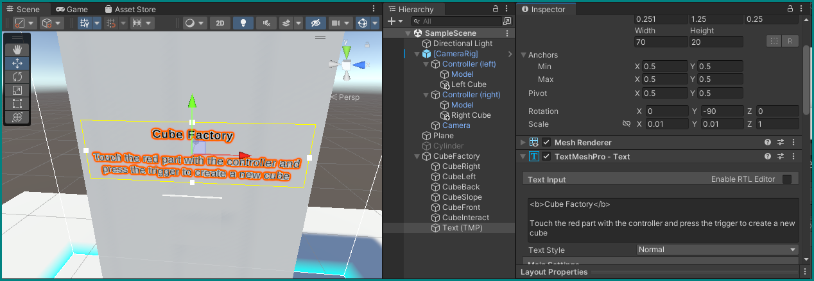

# Runtime: Automated Processes

For now, our scenes have only strictly reacted to our inputs. Let's create some automated processes.

## Reuse the previous project

For this project, let's continue building on our previous one, without having to again import the libraries and creating our cubes or spheres (from the previous [challenge](2-vr-interaction.md/#switching-colors-of-a-material)) that trigger collisions.

Just remove (or deactivate) the cylinder GameObject from the hierarchy and delete the *Controller Input (Script)* component from our \[CameraRig\] GameObject.

## Shape of a cube factory

What's a better example for automation than a factory? Let's make a *cube factory.*

Create a new, empty GameObject in the hierarchy ("Create Empty") and name it `CubeFactory`. Place it at `(-1, 0, -0.25)`.

Now right-click on it to create *child* objects within it: six new cubes. Their names, positions, and scales should be as below.

!!! info "Editing Time Savers"
    You can quickly enter these numbers by hitting the Tab-key after entering each one, which will advance the focus to the next field. You can also save time by omitting the zeros before periods: the editor will fill them in automatically.

1. "CubeRight"
	+ Position `(0, 0.9, 0)`
    + Scale `(0.5, 1.8, 0.25)`
2. "CubeLeft"
	+ Position `(0, 0.9, 0.5)`
    + Scale `(0.5, 1.8, 0.25)`
3. "CubeBack"
	+ Position `(-0.2, 0.9, 0.25)`
    + Scale `(0.1, 1.8, 0.25)`
4. "CubeSlope"
	+ Position `(0, 0.125, 0.25)`
	+ Rotation `(0, 0, 55)`
    + Scale `(0.1, 0.6, 0.25)`
5. "CubeFront"
	+ Position `(0.2, 1.175, 0.25)`
    + Scale `(0.1, 1.25, 0.25)`
6. "CubeInteract"
	+ Position `(0.21, 1, 0.25)`
    + Scale `(0.1, 0.2, 0.2)`

You should end up with a hollow cuboid that has a sloped opening at its lower end — kind of like a chimney. "CubeInteract" should stick out just a little:


### Labeling with TextMeshPro

Another very useful "3D Object" we can add to the factory is *Text - TextMeshPro.* Create one within the CubeFactory GameObject, and give it the following parameters (it may ask you to import some resources the first time you do that — let it):

+ Within the *Rect Transform* component:
    + Position = `(0.251, 1.25, 0.25)`
    + Width = 70, Height = 20
    + Rotation = `(0, -90, 0)`
    + Scale = `(0.01, 0.01, 1)`
+ Center and middle alignment icons in its *TextMeshPro - Text* component
+ The following text in place of "Sample text":

    > &lt;b>Cube Factory<\b>
    >
    > Touch the red part with the controller and press the trigger to create a new cube
+ Set its Vertex Color to anything you like

You should now have a helpful label for the cube factory:



## Factory interaction

For now, it's just an empty structure, doing nothing. Let's change that with some action.

Create a new script for the cube we called __CubeInteract__, called `IsCollidingChecker`. It will be very similar to our old `SwitchColorOnCollide` script:


```csharp title="IsCollidingChecker.cs" hl_lines="5"
using UnityEngine;

public class IsCollidingChecker : MonoBehaviour
{
    public bool isColliding;
    
    public Color[] colors;
    private Material _material;

    // Start is called before the first frame update
    void Start()
    {
        _material = GetComponent<MeshRenderer>().material;
        _material.color = colors[0];
    }

    private void OnTriggerEnter(Collider other)
    {
        isColliding = true;
        _material.color = colors[1];
    }

    private void OnTriggerExit(Collider other)
    {
        isColliding = false;
        _material.color = colors[0];
    }
}
```

The main difference is that it now exposes its `isColliding` boolean variable to other objects. This variable is set to `True` whenever it is in collision, and `False` when not, while at the same time changing colors.

Save the script and assign two colors of your liking to this component [as we did before](2-vr-interaction.md/#switching-colors-of-a-material).

Running the game, you can now switch the color of the CubeInteract object by hitting it with your controller, and you'll also see its *Is Colliding* value change accordingly:


<div style='border-color: #018281; border-style: solid;'>
<div style='overflow: hidden; margin-top:-5.1%; margin-bottom:-34%; position:relative; padding-bottom:calc(70.80% + 33px); clip-path: inset(6.7% 0 45% 0)'>
<iframe src='https://gfycat.com/ifr/welldocumentedultimateappaloosa?controls=0&hd=1' frameborder='0' scrolling='no'' width='100%' height='100%' style='position:absolute;top:0;left:0;'></iframe>
</div></div>

## Factory scripting

The factory is still not working as advertised above this fancy button. Let's change that and make some cubes.

Create a new script for the CubeFactory object itself, called… `CubeFactory`.

!!! info "Script scraps"
    This will be a larger script, so we will from now on only show parts of its code at a time — by now you should be familiar with which parts belong where. Don't worry about the order of variables and functions: as long as they are within the correct scope (brackets), it does not matter which appear first in your script.

We will be using even more libraries now than before, so make sure to include all these `using` statements at the top.

### Variables

```csharp title="CubeFactory.cs"
using System.Diagnostics;
using UnityEngine;
using UnityEngine.InputSystem;
using Valve.VR;
```

Within the `CubeFactory` class definition, declare the following variables:

```csharp title="CubeFactory.cs" hl_lines="5"
public IsCollidingChecker isCollidingChecker;
public SteamVR_Action_Boolean Trigger;
private Stopwatch stopwatch;
public int cooldown = 500;
```

The first two should already be familiar from our [color-changing cylinder](2-vr-interaction/#interacting-with-objects--part-3).

The second two will help us with timing: we only want to let the factory produce cubes at minimum intervals, so we create a [`Stopwatch`](https://learn.microsoft.com/en-us/dotnet/api/system.diagnostics.stopwatch?view=net-7.0) to measure passing time, and a `cooldown` variable that lets us say how long it should rest before pumping out another cube.

```csharp title="CubeFactory.cs" hl_lines="5"
void Start()
{
    stopwatch = new Stopwatch();
    stopwatch.Start();
}
```

At the start of the game, we only *initialize* the `stopwatch` variable using the `new Stopwatch()` command, and `start()` it immediately.

### Cube creation

Let's now create the function that will actually generate new cubes that interact with physics, and with random colors to boot!

```csharp title="CubeFactory.cs"
public GameObject CreateCube()
{
    GameObject cubeGo = GameObject.CreatePrimitive(PrimitiveType.Cube);
    Transform cubeTrans = cubeGo.transform;

    cubeTrans.position = new Vector3(-1f, 0.9f, 0f);
    cubeTrans.localScale = new Vector3(.15f,.15f,.15f);

    cubeGo.GetComponent<MeshRenderer>().material.color = Random.ColorHSV();
    
    Rigidbody cubeRB = cubeGo.AddComponent<Rigidbody>();
    // Add randomness otherwise cubes will all show the exact same trajectory
    cubeRB.velocity = new Vector3(Random.value * .1f,-1,Random.value * .1f) * 5f;
    
    return cubeGo;
}
```

When called, it creates a new GameObject we call `cubeGo` by invoking the GameObject class' [`CreatePrimitive` function](https://docs.unity3d.com/2020.1/Documentation/ScriptReference/GameObject.CreatePrimitive.html), with `PrimitiveType.Cube` as the input.

We take this new object's transform and store a reference to it in a new Transform object called `cubeTrans`, so that we can directly work on it in the next two lines, where we give it a new position and scale.

Similar to how we changed the cylinder's or the CubeInteract's colors, we assign `cubeGo`'s default material a new color, in this case a [`Random` combination](https://docs.unity3d.com/2020.1/Documentation/ScriptReference/Random.ColorHSV.html) of __H__ ue, __S__ aturation, and __V__ alue (brightness).

Finally, we add a Rigidbody component to it, to which we also assign a random (within bounds) velocity, to spice things up a bit in their trajectories.

Since this function is declared not as `void`, it is expected to return something, in this case a `GameObject` (see the first line of the above code — the function's declaration). We obviously want to `return` the just created `cubeGo` object, which is what the last line does.

### Requesting new cubes

We can now go to the `Update()` loop and a call to our cube production function:

```csharp title="CubeFactory.cs"
// Update is called once per frame
void Update()
{
    if (stopwatch.Elapsed.Milliseconds >= cooldown) {
        CreateCube();
        stopwatch.Restart();
    }
}
```

To keep our cube production in check, we must first verify that our set stopwatch has measured enough milliseconds (more than our set cool-down period). Only then will a cube be created, and the stopwatch restarted.

Save the code and see it run: the factory's output is in full swing!

<div style='border-color: #018281; border-style: solid;'>
<div style='overflow: hidden; margin-top:-5.1%; margin-bottom:-34%; position:relative; padding-bottom:calc(70.80% + 33px); clip-path: inset(6.7% 0 45% 0)'>
<iframe src='https://gfycat.com/ifr/leantightduckbillplatypus?controls=0&hd=1' frameborder='0' scrolling='no'' width='100%' height='100%' style='position:absolute;top:0;left:0;'></iframe>
</div></div>

??? info "Trouble with UnityEngine.InputSystem?"
    It may be that your code editor and the Unity complain about a missing `UnityEngine.InputSystem`. This can be easily fixed by going to the [package manager](2-vr-interaction.md/#installing-and-importing-packages) and searching for `InputSystem` in the *Unity Registry*. Install it, which will also prompt Unity configure some settings and restart the editor, so make sure to save your changes before doing so.

### Controlling factory output

To avoid a [Tribbles-type situation](https://en.wikipedia.org/wiki/The_Trouble_with_Tribbles), we need to have some control over the factory's cube output.

<div style='border-color: #018281; border-style: solid;'>
<div style='overflow: hidden; position:relative; margin-top:-5%; margin-bottom:-10%;padding-bottom:calc(70.80% + 33px); clip-path: inset(6.7% 0 13% 0)'>
<iframe src='https://gfycat.com/ifr/importantmagnificentbongo?controls=0&hd=1' frameborder='0' scrolling='no'' width='100%' height='100%' style='position:absolute;top:0;left:0;'></iframe>
</div></div>

We can add some more conditions to our `if` statement in the `Update()` loop to only allow authorized personnel to run the production:

```csharp title="CubeFactory.cs" hl_lines="3 4 5"
void Update()
{
    if (stopwatch.Elapsed.Milliseconds >= cooldown
        && isCollidingChecker.isColliding
        && Trigger.state)
    {
        CreateCube();
        stopwatch.Restart();
    }
}
```

The And-operator `&&` can be used to chain logic statements together. You can put everything within the round brackets of the `if()` statement in one line, but this way we preserve legibility of an otherwise unwieldy, long line.

Now the `if()` statement will execute its block if the stopwatch has measured more than `cooldown`, AND a collision is detected by the CubeInspect object, AND the trigger is pulled. If any one of these conditions is not true, no cubes will be produced. This should keep the factory floor safe.

Save the code, go back to the editor, and assign the CubeInteract object's *Is Colliding Checker* component to the cube factory script component ([like we did with the cylinder](2-vr-interaction.md/#steamvr-actions)), and set the Trigger again to *InteractUI* ([see cylinder](2-vr-interaction.md/#steamvr-actions)).

<div style='border-color: #018281; border-style: solid;'>
<div style='overflow: hidden; margin-top:-5.1%; margin-bottom:-34%; position:relative; padding-bottom:calc(70.80% + 33px); clip-path: inset(6.7% 0 45% 0)'>
<iframe src='https://gfycat.com/ifr/affectionateseveraldog?controls=0&hd=1' frameborder='0' scrolling='no'' width='100%' height='100%' style='position:absolute;top:0;left:0;'></iframe>
</div></div>

??? tip "Manual override"
    Often it is good to include a manual override over conditions like we have above for the cube production. You can extend the `if()` statement with one more clause, this time an OR `||` operator to make it look like this:
    ```csharp
    if (stopwatch.Elapsed.Milliseconds >= cooldown
        && isCollidingChecker.isColliding
        && Trigger.state
        || Keyboard.current.spaceKey.wasReleasedThisFrame)
    ```
    Now the *only* condition necessary to trigger the production of the next cube the user hitting the space button on the computer that's running Unity (while focused on the Game view), bypassing all other rules. Cubes will be now produced as fast as you can press the space bar — don't break it!

## Cube removal

Even with controlled production, cubes still pile up eventually. Let's clean them up.

### Destroyer script

Create a new script in the scripts folder without attaching it to any GameObject and name it `DestroyOnTouch`. We want it to come into action every time our controllers (i.e., their attached cubes or spheres) collide with a freshly produced cube to pop them into oblivion.

```csharp title="DestroyOnTouch.cs"
using System;
using System.Collections;
using UnityEngine;

public class DestroyOnTouch : MonoBehaviour
{
    private void OnTriggerEnter(Collider other)
    {
        Destroy(gameObject);
    }
}
```

The now familiar `OnTriggerEnter()` function will simply call the `Destroy()` command on `gameObject` itself, which refers to the GameObject this script is working within. As it is now, the code just sits in our Scripts folder and does nothing, so let's attach it to all factory-fresh cubes our CubeFactory is producing.

### Attaching the destroyer

To attach this script (*make sure to save it first!*) to new cubes, we simply need to modify the `CreateCube()` function within `CubeFactory`:

```csharp title="CubeFactory.cs" hl_lines="15"
public GameObject CreateCube()
{
    GameObject cubeGo = GameObject.CreatePrimitive(PrimitiveType.Cube);
    Transform cubeTrans = cubeGo.transform;

    cubeTrans.position = new Vector3(-1f, 0.9f, 0f);
    cubeTrans.localScale = new Vector3(.15f,.15f,.15f);

    cubeGo.GetComponent<MeshRenderer>().material.color = Random.ColorHSV();
    
    Rigidbody cubeRB = cubeGo.AddComponent<Rigidbody>();
    // Add randomness otherwise cubes will all show the exact same trajectory
    cubeRB.velocity = new Vector3(Random.value * .1f,-1,Random.value * .1f) * 5f;

    cubeGo.AddComponent<DestroyOnTouch>();
    
    return cubeGo;
}
```

The highlighted line shows how the (publicly known) `DestroyOnTouch` is added as a component to each new `cubeGo` object, just before it is returned.

Save this code and try it out:

<div style='border-color: #018281; border-style: solid;'>
<div style='overflow: hidden; margin-top:-5.1%; margin-bottom:-34%; position:relative; padding-bottom:calc(70.80% + 33px); clip-path: inset(6.7% 0 45% 0)'>
<iframe src='https://gfycat.com/ifr/heartfeltevergreenkilldeer?controls=0&hd=1' frameborder='0' scrolling='no'' width='100%' height='100%' style='position:absolute;top:0;left:0;'></iframe>
</div></div>

### Making it pop

Let's turn the chore of cleaning up cubes into a more fun activity by adding some pop.

As immersive as VR is, you can heighten this even more by engaging additional senses, such as our hearing. Unity is of course capable of audio playback, so let's have it play a short sample every time we destroy a cube, such a simple "pop" sound.

!!! question "Where to get sound samples?"
    If you're not inclined to record or [synthesize](https://supercollider.github.io) your own audio, the popular website [freesound.org](https://freesound.org) is a great, free, source of all kinds of audible material.
    
    To save you some time for now, you can also download this .mp3 clip and use it: <a href="pop.mp3" download>pop.mp3</a>

Create a new folder in Assets called `Resources`, and store your audio sample there and rename it `pop.mp3`, if it's not already called that.

Go back to our `CreateCube()` function and add two lines:

```csharp title="CubeFactory.cs" hl_lines="17 18"
public GameObject CreateCube()
{
    GameObject cubeGo = GameObject.CreatePrimitive(PrimitiveType.Cube);
    Transform cubeTrans = cubeGo.transform;

    cubeTrans.position = new Vector3(-1f, 0.9f, 0f);
    cubeTrans.localScale = new Vector3(.15f,.15f,.15f);

    cubeGo.GetComponent<MeshRenderer>().material.color = Random.ColorHSV();
    
    Rigidbody cubeRB = cubeGo.AddComponent<Rigidbody>();
    // Add randomness otherwise cubes will all show the exact same trajectory
    cubeRB.velocity = new Vector3(Random.value * .1f,-1,Random.value * .1f) * 5f;

    cubeGo.AddComponent<DestroyOnTouch>();

    AudioSource cubeAS = cubeGo.AddComponent<AudioSource>();
    cubeAS.clip = Resources.Load<AudioClip>("pop");
    
    return cubeGo;
}
```

With those, we're adding another component to the new cubes, this time an [`AudioSource`](https://docs.unity3d.com/2020.1/Documentation/ScriptReference/AudioSource.html), and loading into its `clip` component our .mp3 file, using [`Resources.Load<AudioClip>("pop")`](https://docs.unity3d.com/2020.1/Documentation/ScriptReference/Resources.html).

The latter call will actually search the Resources folder we created above for any audio files that are named "pop" before their file type extension, which is why it was important to name our clip "pop.mp3".

Go back to our `DestroyOnTouch` script to modify it. We're adding a new `private` variable called `_audioSource`, and fetch it from the component the factory is now adding to new cubes using the `Start()` function.

```csharp title="DestroyOnTouch.cs"
public class DestroyOnTouch : MonoBehaviour
{
    private AudioSource _audioSource;

    private void Start()
    {
        _audioSource = GetComponent<AudioSource>(); // Last part of the tutorial (with pop sound added)
    }
}
```

??? info "Wen Start()?"
    `Start()` is actually not always called "before the first frame update" as its comment implies. If an object was created during the duration of the game, many frames could have obviously passed before this event. Furthermore, if an object is created and *deactivated* immediately before any frames have passed, `start()` is still not called.

    It is only ever called when just before an object "experiences" its first passing frame.

Now let's change the remainder of `DestroyOnTouch` to actually play back the sound on destruction:

```csharp title="DestroyOnTouch.cs" hl_lines="3 4"
private void OnTriggerEnter(Collider other)
{
    // Destroy(gameObject);
    StartCoroutine(PlayAudioThenDestroy()); // Last part of the tutorial (with pop sound added)
}

private IEnumerator PlayAudioThenDestroy()
{
    // Hide object
    Destroy(GetComponent<MeshRenderer>());
    // Delete collider component to prevent calling this coroutine twice
    Destroy(GetComponent<Rigidbody>());
    // Play pop sound
    _audioSource.Play();
    yield return new WaitUntil(() => !_audioSource.isPlaying);
    // Actually destroy the object now
    Destroy(gameObject);
}
```

In `OnTriggerEnter()`, we *comment out* our previous line that simply destroys the object (rendering it inert) and instead add a `StartCoroutine()` call on the `IEnumerator` block we declare below.

!!! info "Coroutines"
    [*Coroutines*](https://docs.unity3d.com/2020.1/Documentation/ScriptReference/Coroutine.html) are a very powerful feature of Unity (and overall [computing concept](https://en.wikipedia.org/wiki/Coroutine)), which allow delayed execution of code without tying up the whole system — effectively allowing parallel execution of multiple things.
    
    This will be explored in more detail in the [following tutorial](4-coroutines.md), but feel free to try to understand the `PlayAudioThenDestroy()` function here from its context and comments.

Save the code, run the game. It pops!