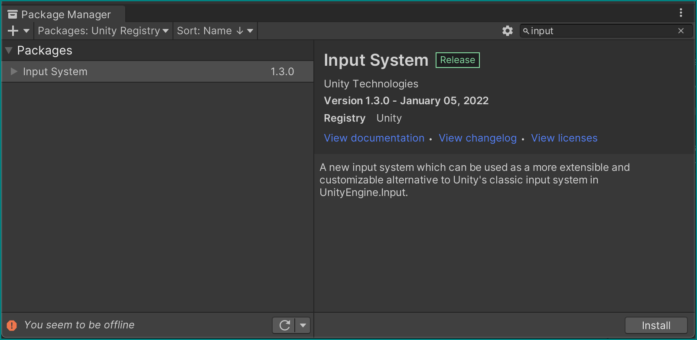
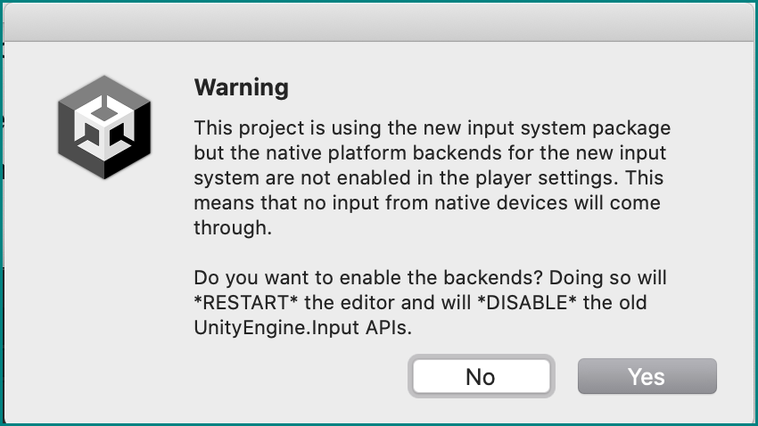
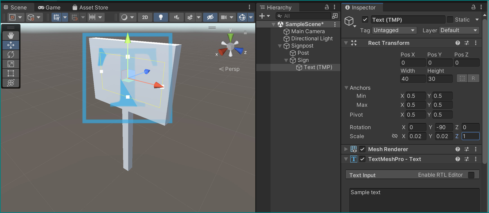
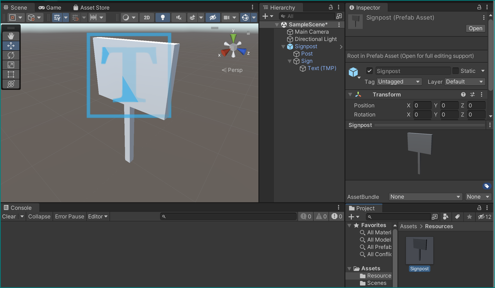

# Saving, Loading, and Writing

We've seen how Unity can [load an audio file](3-runtime.md#making-it-pop) and use it. Now let's see how we can make it create new files by itself, like we would like it to for recording results from experiments.

## New project

Let's make a new Unity project for this part, as we won't be needing VR for it. Go back to the [Unity Hub and do so](1-first-project.md#create-a-first-project-using-the-unity-hub).

We're going to need the functionality of accessing a user's input, so we need to install the *Input System* package from the [Package Manager](2-vr-interaction.md#installing-and-importing-packages):



This may trigger a warning and a prompt to restart the Unity Editor. Allow it:



We should now be all set to get going with this new project!

## Set the scene

Let's add some objects to the scene.

### A signpost

Create an empty GameObject and name it "Signpost", making sure it sits at the world origin (Position =`(0,0,0)`).

Right-clicking on this object, create two new cubes as its *children* with the following parameters:

+ First cube:
    + Name = "Post"
    + Position = `(0,.5,0)`
    + Scale = `(.09,1,.09)`
+ Second cube:
    + Name = "Sign"
    + Position = `(0,1.3,0)`
    + Scale = `(.1,.7,1)`

Now add a *Text - TextMeshPro* object as a child to sign object in the hierarchy and give it the following parameters:

+ Width = 40, height = 30
+ Position = `(0.55,0,0)`
+ Rotation = `(0,-90,0)`
+ Scale = `(.02,.02,1)`
+ Give its text a centered alignment



### Prefabs

Let's now turn this signpost into a *Prefab* — a reusable, preset object that can be easily re-created by Unity.

Make a new `Resources` folder  within our assets, and simply drag our whole Signpost GameObject from the hierarchy directly in it — a prefab with its parameters is created, giving our Signpost a blue icon!



Remove the Signpost now from our hierarchy — we will use its prefab later.

## Reading files: texts and textures

Let's get Unity to read some external files to work with in our project — in our case to spice up the appearance of our signpost.

Create a text file inside the Resources folder: right-click it (or within it) in the project browser to open in in Finder/Explorer, and use any old text editor for the next steps.

Name it `SignpostData.txt`, and give it the following contents:

``` title="SignpostData.txt"
pos:-2,0,-1
col1:0.9,0.67,0.42
col2:1,1,1
txt:<i>NOTICE</i><br>Some text<br>To display<br>for information
```

As you may guess, we will use this to put text on the signpost and adjust its position.

To give it some texture instead of the elegant but simple white, <a href="https://www.freepik.com/free-photo/oak-wooden-textured-design-background_18835065.htm#query=wood%20texture&position=0&from_view=keyword" download>download this image</a> and also place it into Resources, renaming it `SignpostTexture.jpg` in the process.

Create a Scripts folder inside Assets (there shouldn't be one there yet), make a new script there called `LoadFromResources` and attach it to our Floor object as a component:

```csharp title="LoadFromResources.cs" hl_lines="14 15"
using System.Collections.Generic;
using System.Linq;
using TMPro;
using UnityEngine;

public class LoadFromResources : MonoBehaviour
{
    // Start is called before the first frame update
    void Start()
    {
        // Fill this next!
    }
}
```

For now it doesn't do anything, so let's give is some functionality — all __within__ its `Start()` method, step by step.

Create variables that can hold a GameObject, a string, and a [Texture2D](https://docs.unity3d.com/ScriptReference/Texture2D.html):

```csharp title="LoadFromResources.cs"
GameObject signpostPrefab = Resources.Load<GameObject>("Signpost");
string signpostData = Resources.Load<TextAsset>("SignpostData").text;
Texture2D signpostTexture = Resources.Load<Texture2D>("SignpostTexture");
```

These variables are immediately assigned the output of their respective [`Resources.Load<Type>("File name")`](https://docs.unity3d.com/ScriptReference/Resources.Load.html) methods, which look for files with a specific name within the *Resources* folder we created before, *reads* them, and converts them into the specified *type*: a *GameObject* fashioned after the Signpost *prefab*, a *Texture2D* from our supplied picture, and a *string* from our SignpostData.txt file.

This last variable, the `signpostData` string is still somehow vague in its use, so let's change that with a *parsing* function. Add it right after the previous code block, still inside `Start()`:

```csharp title="LoadFromResources.cs"
// Parse text file to get custom signpost data
Dictionary<string, string> SPdataParsed = new Dictionary<string, string>();

foreach (string line in signpostData.Split('\n'))
{
    if (line.Length == 0) continue;

    // Split each line by key:value and store in dictionary
    string[] lineSplit = line.Split(':');
    SPdataParsed.Add(lineSplit[0], lineSplit[1]);
}
```

This creates a [`Dictionary`](https://learn.microsoft.com/en-us/dotnet/api/system.collections.generic.dictionary-2?view=net-7.0) from our text file, taking the colon (:) as a separator for each line: the left part of a line before it (e.g., `pos`) becomes a *key* and the right part (e.g., `-2,0,-1`) the *value.*

!!! Warning "Parsing issues"
    Depending on your operating system's language settings, the parser may mess up this format: in some languages, a comma is used in place of the decimal point in mixed numbers, etc. — this can cause problems when parsing strings.

    A possible solution is to set the `CultureInfo.InvariantCulture` *default,* as explained in [this Stack Overflow entry](https://stackoverflow.com/questions/12729922/how-to-set-cultureinfo-invariantculture-default).
    You need to include another library that your script *uses*: `#!csharp using System.Threading;`, which will allow you to add this line to the beginning of your `Start()` function:
    
    `#!csharp Thread.CurrentThread.CurrentCulture = System.Globalization.CultureInfo.InvariantCulture;`


### Instantiating a prefab

We can now use the information gotten from our signpostData.txt file to [*instantiate*](https://docs.unity3d.com/ScriptReference/Object.Instantiate.html) Signpost objects from the Signpost prefab and assign to them parameters that we store in our `SPdataParsed` dictionary:

```csharp title="LoadFromResources.cs" hl_lines="6 11 15"
// Instantiate prefab as a new gameobject
GameObject signpostGo = GameObject.Instantiate(signpostPrefab);
Transform signpostTrans = signpostGo.transform;

// Set signpost world position
float[] posRaw = SPdataParsed["pos"].Split(',').Select(float.Parse).ToArray();
signpostTrans.position = new Vector3(posRaw[0], posRaw[1], posRaw[2]);

MeshRenderer[] meshRenderers = signpostGo.GetComponentsInChildren<MeshRenderer>();
// Set colour of first child in signpost object (post) 
float[] col1Raw = SPdataParsed["col1"].Split(',').Select(float.Parse).ToArray();
meshRenderers[0].material.color = new Color(col1Raw[0], col1Raw[1], col1Raw[2]);

// Set colour of second child in signpost object (sign)
float[] col2Raw = SPdataParsed["col2"].Split(',').Select(float.Parse).ToArray();
meshRenderers[1].material.color = new Color(col2Raw[0], col2Raw[1], col2Raw[2]);

meshRenderers[0].material.mainTexture = signpostTexture;
meshRenderers[1].material.mainTexture = signpostTexture;

// Set text
TextMeshPro signpostTMP = signpostGo.GetComponentInChildren<TextMeshPro>();
signpostTMP.text = SPdataParsed["txt"];
```

These last lines of the `Start()` function should mostly speak for themselves, even the highlighted operations performed the string values from in the dictionary, though they might contain so far unseen methods like [`Split()`](https://learn.microsoft.com/en-us/dotnet/api/system.string.split?view=net-7.0) and [`Select()`](https://learn.microsoft.com/en-us/dotnet/api/system.linq.enumerable.select?view=net-7.0) — try to understand what they do (the links should help).

Save the now completed LoadFromResources script, and run the game — you will see a now wooden signpost with some text on it appear at the coordinates given in the text file! It even changed the colors of the different parts of the post, making it even more realistic. You may need to move the camera bit too see it well, though:


!!! example "Challenge: moving the camera, too"
    Can you apply the same method to also move the camera to a new different position?

    You would need to add a new line to the text file, and amend your *parser* to turn this instruction into action.

## Playlists

Our `LoadFromResources` script has done its job — disable or remove it from the Floor object.

Lets get a bit more fancy and create a playlist to sequence events; in this case we want a number of images to load and show up on the scene, one after another.

### Placing external resources

Create a new folder *ouside* the Assets folder (besides it) called `ExternalData`. Within that new folder, place a new text file called `playlists.txt` with exactly the following content:

```title="playlists.txt"
0,1,2,3,4,5
5,4,3,2,1,0
```

!!! info "Form vs content"
    The *format* is important here, meaning the number of items in one line, them being separated by commas, etc.

    You can change the order of the numbers, add more lines in the same format, etc. — this flexibility is the whole point of creating a simple playlist file format like this!

Within the ExternalData folder, create a new folder called `images`. Download the six images from here (<a href="external/img_00.jpg" download>1</a>, <a href="external/img_01.jpg" download>2</a>, <a href="external/img_02.jpg" download>3</a>, <a href="external/img_03.jpg" download>4</a>, <a href="external/img_04.jpg" download>4</a>, <a href="external/img_05.jpg" download>6</a>) and place them inside `images` in the project browser — make sure to keep their filenames intact (`img_00.jpg`, etc.).

### Parsing and playing playlists

We want these images to displayed on a *Quad* 3D object in the scene, so create one in the hierarchy with the following parameters:

+ Name = `DisplayQuad`
+ Position = `(-1.5,1.3,0)`
+ Rotation = `(0,-90,0)`
+ Scale = `(1.92,1.08,1)`
    + 1.92 and 1.08 — multiply by 1,000 and you get 1920 and 1080. Looks familiar?

Create a new script for the floor named `LoadFromExternalFolder` to put them into action:

```csharp title="LoadFromExternalFolder.cs" hl_lines="12 13 14"
using System.Collections;
using System.IO;
using System.Linq;
using UnityEditor;
using UnityEngine;

public class LoadFromExternalFolder : MonoBehaviour
{
    public static string dirpathname = "ExternalData";
    public static string dirpath;

    public MeshRenderer displayQuadMR;
    private Material displayQaudMat;
    public int subj_index = 0;

    private int[] playlist;

    public Texture2D LoadImageAsTexture(string filePath)
    {
        // Load raw data from file
        byte[] fileData = File.ReadAllBytes(filePath);

        Texture2D tmpTex = new Texture2D(1920, 1080, TextureFormat.RGB24, false);
        tmpTex.LoadImage(fileData);

        return tmpTex;
    }
}
```

??? info "Assumptions"
    The `LoadImageAsTexture()` function makes a lot of assumptions here. First, we assume that there is a valid file path stored in `filePath` at all, and not just gibberish. Then we further assume that the data at that location is an image that can be loaded in a texture, even with the specific dimensions `1920, 1080` and in `RGB24` color format.

    While getting the dimensions and color format wrong wouldn't cause that much trouble other than a potentially garbled image, trying to read a file that's not there can cause the game to crash!

    Ususally, you would *guard* agains this by first checking if the file exists at all, and wouldn't you know it, there's a fuction for that: [`File.Exists()`](https://docs.unity3d.com/ScriptReference/Windows.File.Exists.html).
    
    To be on the safe side, you can check the result of `File.Exists(filePath)` in an `if()` statement and only proceed with loading if it's positive. Keep in mind that you still have to return *some* `Texture2D` and can't just return from you function with nothing to show for…
    
    All this to say: Playing it safe is not for lazy people, but it can sure give you a feeling of security (and save you from some crashes).

Being very similar in structure to our previous script, it should be quite clear what it does. The difference so far are the variables to hold our Quad's MeshRenderer and Material, and and index to keep track of our subject. Let's use these in the `Start()` method:

```csharp title="LoadFromExternalFolder.cs" hl_lines="30"
IEnumerator Start()
{
    displayQaudMat = displayQuadMR.material;
    
    dirpath = Directory.GetParent(Application.dataPath).ToString() + Path.DirectorySeparatorChar + dirpathname;
    
    // image order playlist
    //    A line represent the order to display images
    //    There is one line per subject
    
    // Load entire image order playlist file segmened by line return
    playlist = File.ReadAllLines($"{dirpath}/playlists.txt")
        // Skip all lines to go to the one we want
        .Skip(subj_index)
        // Get one line
        .Take(1).First()
        // Split line by comma
        .Split(',')
        // Convert string to int
        .Select(int.Parse).ToArray();

    for (int ipl = 0; ipl < playlist.Length; ipl++)
    {
        int iImg = playlist[ipl];
        displayQaudMat.mainTexture = LoadImageAsTexture($"{dirpath}/images/img_{iImg:D2}.jpg");
        
        yield return new WaitForSeconds(2f);
    }
    
    Application.Quit();
#if UNITY_EDITOR
    EditorApplication.isPlaying = false;
#endif
}
```

Save the script, make sure its attached as a component to our floor, and assign our Quad to the appropriate field.

It will now cycle through the images it loads in the given sequence read from the playlists file, which we can specify in the components inspector with the *Subj_index* field (starting with 0), and then quit the game!

??? info "Preprocessor Directives — Conditional Compilation in Unity"
    There are specially highlighted lines in the code snipped above which start with the number sign `#`, called [*Preprocessor Directives*](https://docs.microsoft.com/en-us/dotnet/csharp/language-reference/preprocessor-directives) in C#.

    They are used for [*Conditional Compilation*](https://docs.unity3d.com/Manual/PlatformDependentCompilation.html) — typical uses are to let Unity check if the game is running in the editor or as a compiled standalone application, or what the current operating system is. This is important for dertain functions which may behave differently in different conditions, and using these directives you can choose which blocks of code to use for which scenario.

    Here, we issue the command `#!charp EditorApplication.isPlaying = false` only if we run it inside the editor to end the game — this wouldn't work in a standalone application, where `#!Application.Quit()` would be required for the same.

<div style='border-color: #018281; border-style: solid;'>
<div style='overflow: hidden; position:relative; margin-top:-5%; margin-bottom:-10%;padding-bottom:calc(70.80% + 33px); clip-path: inset(6.7% 0 13% 0)'>
<iframe src='https://gfycat.com/ifr/perfectsmartcoypu?controls=0&hd=1' frameborder='0' scrolling='no'' width='100%' height='100%' style='position:absolute;top:0;left:0;'></iframe>
</div></div>

## Writing to files

Let's now turn the tables on our file system and *write* something to it, instead of only reading!

Deactivate the display Quad, deactivate the LoadFromExternalFolder component from our Floor, and create yet another new script for it. Call it `SaveToExternalFolder`:

```csharp title="SaveToExternalFolder.cs" hl_lines="14"
using System;
using System.Collections;
using System.IO;
using UnityEngine;
using UnityEngine.InputSystem;

public class SaveToExternalFolder : MonoBehaviour
{
    public static string dirpathname = "ExternalData/subjData/";
    public static string dirpath;
    
    public int subj_index = 0;

    private StreamWriter expeDataWriter;
    
    public static long GetTimestamp()
    {
        return DateTimeOffset.Now.ToUnixTimeMilliseconds();
    }

    private void OnApplicationQuit()
    {
        expeDataWriter.Flush();
        expeDataWriter.Close();
    }
}
```

For now it only contains the now-familiar variables to hold the names of file paths and subject index, as well as a [`StreamWriter`](https://learn.microsoft.com/en-us/dotnet/api/system.io.streamwriter?view=net-6.0) and a simple *getter* method that returns a *time stamp* using the [`DateTimeOffset`](https://learn.microsoft.com/en-us/dotnet/api/system.datetimeoffset.now?view=net-6.0) structure.

There is now also a method called `OnApplicationQuit()` — similar to how `Start()` is automatically executed by Unity when you press the Play button, this one runs just as stop the game, be it by pressing the play button again or quitting the whole Unity editor (or the final, built [binary executable](https://docs.unity3d.com/Manual/WindowsStandaloneBinaries.html)).

This is important if you're writing to external files: the `Flush()` and `Close()` commands make sure that all potentially unwritten contents of the StreamWriter are *flushed out* to the file, and that the file is then properly closed — this is just basic file system hygiene, perhaps not too dissimilar from the one you practice yourself.

Let's put these things together in a `Start()` IEnumerator:

```csharp title="SaveToExternalFolder.cs"
IEnumerator Start()
{
    dirpath = Directory.GetParent(Application.dataPath).ToString() + Path.DirectorySeparatorChar + dirpathname;
    
    Directory.CreateDirectory($"{dirpath}");
    
    expeDataWriter = new StreamWriter($"{dirpath}/subj_{subj_index}.txt");
    
    while (true)
    {
        yield return new WaitUntil(() => Keyboard.current.anyKey.wasReleasedThisFrame);

        for (int ik = 0; ik < Keyboard.KeyCount; ik++)
        {
            string keyName = Keyboard.current.allKeys[ik].ToString();
            bool keyState = Keyboard.current.allKeys[ik].wasReleasedThisFrame;

            if (!keyState) continue;
            
            string message = $"{GetTimestamp()}: user released \"{keyName}\"";
            expeDataWriter.WriteLine(message);
            print(message);
        }
    }
}
```

First, it [creates a new directory](https://learn.microsoft.com/en-us/dotnet/api/system.io.directory.createdirectory?view=net-6.0) at the constructed `dirpath` if it doesn't exist yet, then instantiates a new `StreamWriter` with a new file, which itself is constructed from the `dirpath` and the `subj_index` using [*String Interpolation*](https://learn.microsoft.com/en-us/dotnet/csharp/language-reference/tokens/interpolated) (the `$` sign). Try to understand how the final file name and directory are being assembled!

Then an endless loop (`while (true)`) is being run that keeps waiting for the user to hit (or rather *release* after hitting) keys on the keyboard using `WaitUntil` and the new [*Unity Input System*](https://docs.unity3d.com/Packages/com.unity.inputsystem@1.0/manual/QuickStartGuide.html) in the shape of `Keyboard.current.anyKey.wasReleasedThisFrame`.

It then looks at which keys were being pressed and puts their names in a string. As we can't easily access the exact key that was pressed, we just write down all current keys (`Keyboard.current.allKeys`). We then check if one of these current keys was just released in the last frame — if not, we exit this loop with the [`continue` jump statement](https://learn.microsoft.com/en-us/dotnet/csharp/language-reference/statements/jump-statements).

If the key *was* just released, we formulate a message including its name and the current time stamp (from our `GetTimeStamp()` method), and hand it over to the `expeDataWriter` to write a line in our external file using `WriteLine()`. Additionally, we `print` this message to the console.

And that's it for external files! Now let's finally try out interacting with gaze data in Unity in the next tutorial.

!!! example "Challenge: elapsed time"
    Instead of writing the time stamp (the absolute, real-world time), how about writing down the time that has elapsed between two key releases? To calculate that, you would need to keep track of the time the last key was pressed and subtract that from the current time. Give it a try if you want!

!!! example "Challenge: slide show"
    Can you combine the functionality of our last script with the previous one to have the user manually advance the images shown in on the signpost?


<!-- 
```csharp title="LoadFromResources.cs" hl_lines="14 15"
using System.Collections;
using System.IO;
using System.Linq;
using UnityEditor;
using UnityEngine;

public class LoadFromExternalFolder : MonoBehaviour
{
    public Texture2D LoadImageAsTexture(string filePath)
    {
        // Load raw data from file
        byte[] fileData = File.ReadAllBytes(filePath);

        Texture2D tmpTex = new Texture2D(1920, 1080, TextureFormat.RGB24, false);
        tmpTex.LoadImage(fileData);

        return tmpTex;
    }
}
```

`LoadImageAsTexture(string filePath)` takes a file path `string` and attempts to load anything it can find at this location into a `byte` array called `fileData`.

Because we promise to only use this function in accordance to its name and only load images with it, we can force the loaded byte array into a [`Texture2D`](https://docs.unity3d.com/ScriptReference/Texture2D.html) variable with the highlighted lines. The resulting texture is returned.


Let's do something with the texture we hopefully load here — assign it to the signpost! Add some variables and the `Start()` IEnumerator to our script:


```csharp title="LoadFromResources.cs" hl_lines="14 15"

public static string dirpathname = "ExternalData";
public static string dirpath;

public MeshRenderer displayQuadMR;
private Material displayQaudMat;

IEnumerator Start()
{
    displayQaudMat = displayQuadMR.material;
    
    dirpath = Directory.GetParent(Application.dataPath).ToString() + Path.DirectorySeparatorChar + dirpathname;

    displayQaudMat.mainTexture = LoadImageAsTexture($"{dirpath}/images/img_{iImg:D2}.jpg");
}
``` -->