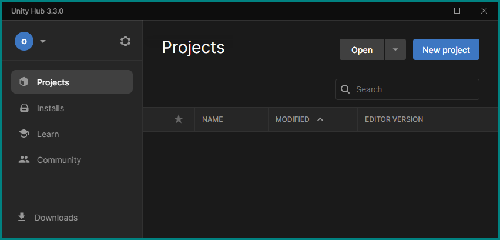
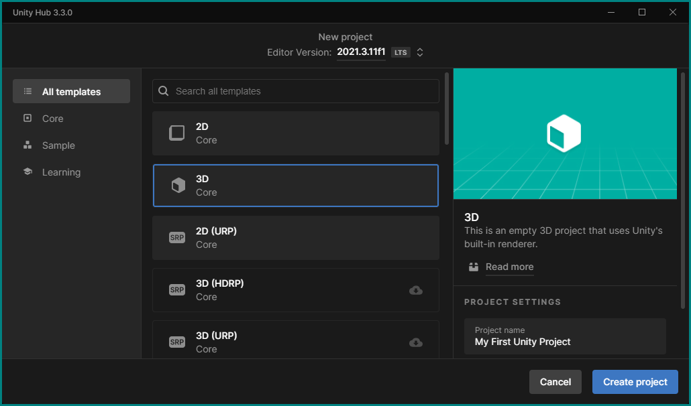

# First Unity Project

## Create A Project Using The Hub

<!--  -->

If not already running on your computer, start the Unity Hub (see the icon above). Depending on previous use there may be already projects listed in its window — if so, disregard them for now and just click the __New project__ button.

You will be presented with a dialog to configure the project. Usually it's already all set up correctly, but to make sure just verify the following points:

+ __Editor Version__ should be the latest one from the list (2021.3.11f1 in our case),
+ The __3D__ *template* should be selected,
+ Don't forget to give your first project a name and choose a location (the default works here).

