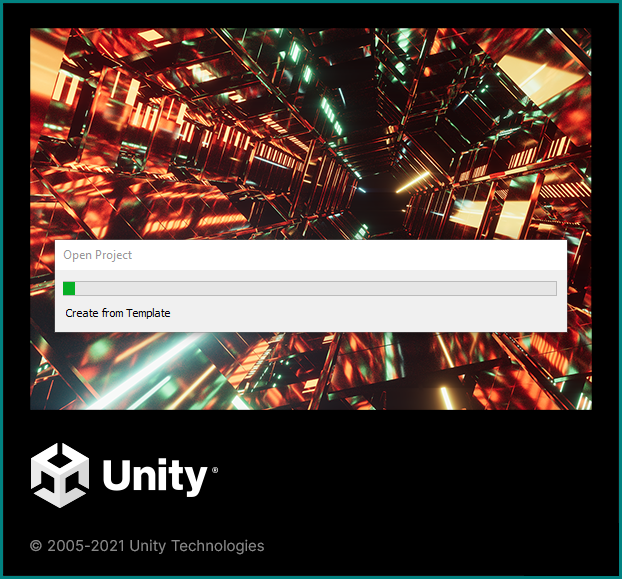
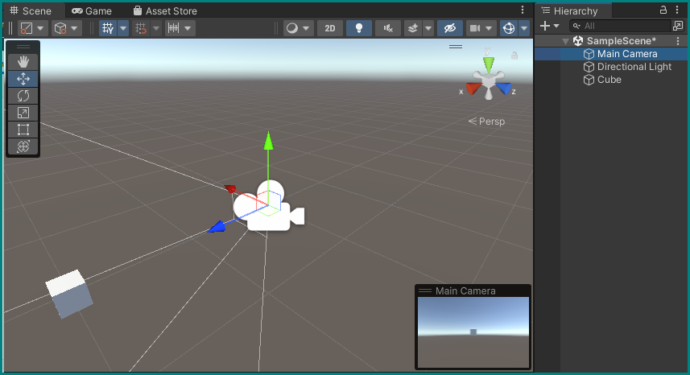
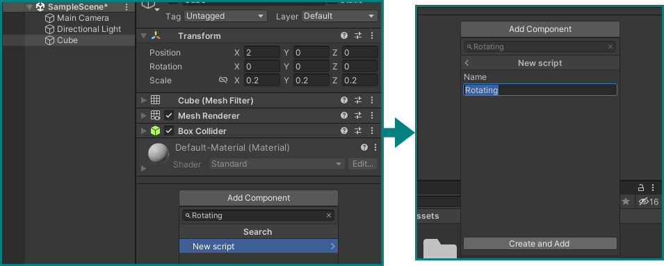

# First Unity Project — getting to know the Editors


<!--  -->

## Create a first project using the Unity Hub

If not already running on your computer, start the Unity Hub (see the icon above). Depending on previous use there may be already projects listed in its window — if so, disregard them for now and just click the __New project__ button.


You will be presented with a dialog to configure the project. Usually it's already all set up correctly, but to make sure just verify the following points:

+ __Editor Version__ should be the latest one from the list (2021.3.11f1 in our case),
+ The __3D__ *template* should be selected,
+ Don't forget to give your first project a name and choose a location (the default works here).


Pushing the __Create project__ button will open the *Unity Editor* and tell it create a new project with the above parameters. This may take some time…



## Setting up the Editor

Once this process is complete, you will see a the Unity Editor in its default configuration, showing a blank *scene.*


You can leave this as is, or drag the tab handles and section dividers around to create a more comfortable working environment. One particularly important change would be to permanently reveal the *Console* window by dragging the *Project* window it's being obscured by to a new location. Below is our suggested arrangement with new placements of the *Hierarchy,* *Project,* and *Console* windows.


The biggest part should show you the *__Scene__ View,* where you can freely navigate using common 3D software controls, like zooming in and out with the mouse wheel, rotating by holding the right mouse button, and translating your position by holding the middle mouse button. See the [official Unity manual](https://docs.unity3d.com/Manual/SceneViewNavigation.html) on more information on this.

## Scene, Hierarchy, and Camera Views + Inspector

The Scene View shows you the contents of your currently open *Scene* — a kind of super *Object* that holds all other objects. A full overview of all objects and their relationships is shown in the *__Hierarchy__ window* — as you can see, it currently only contains our only Scene (__SampleScene__), which holds a simple *Directional Light* for illuminating the world and the *Main Camera* that lets a player see it. Let's select that camera by clicking on it in the *Hierarchy* or on its *Gizmo* (camera icon) in the *Scene* view:


It is now highlighted in both *Scene* and *Hierarchy* views, as shown by a highlight and the appearance of arrows pointing in the cardinal directions around the object. In addition, a view from this camera now shows up in the Scene view as a floating window: this is what a player of this game will see if we run it. The same view is visible in a full window by selecting the *Game* tab in the Scene window.

Another thing that happens when we select a *Game Object* like this camera in the editor is the appearance of this object's *__Inspector__* in its previously empty window to the top right. This window allows us to view and change every single aspect of any Game Object, which may differ by their type. One *Component* all possible objects, be they cameras, lights, or dinosaur models share is their *Transform:* a grid that contains the coordinates of their position, rotation vector, and its scale.

??? info "Transforms and Hierarchies"
    In the case of the camera and light and any other objects directly under the __SampleScene__ Scene object, these coordinates are equivalent to their "world" coordinates. For any object that sits below another in the Hierarchy, these coordinates are basically offset by those of their *Parent.* See Unity's documentation on the [Hierarchy](https://docs.unity3d.com/Manual/Hierarchy.html) and [Transforms](https://docs.unity3d.com/Manual/class-Transform.html) for more details.

Let's set the camera's Position to the *origin* and rotate it to point in the blue arrow's (the Z-axis) direction by editing its Transform Component accordingly: set Position `X=0, Y=0, Z=0` and Rotation `X=0, Y=90, Z=0`.


## Creating a first object

Let's bring a cube into the scene.

While you can go to the main menu under *GameObject* and select what you want to create, a more precise way is to right-click on an empty part of the Hierarchy and selecting __3D Object → Cube__. This will create a basic cube *GameObject* inside our Scene, with a default Transform. If we had right-clicked on any existing object in the scene instead of on an empty space, we would have created a *child* object that would be tied to its *parent,* and this is not what we want in this case.


If you double-click on the new Cube object in the hierarchy, the scene view will fully zoom into it, showing that it basically swallowed our camera. If you select our camera object again, its view (or the Game View) won't show the cube — the way most 3D engines work, objects are transparent from the inside.


Let's move the box to a position where the camera can see it, and also try making it smaller by setting its transform component to Position `X=2, Y=0, Z=0` and Scale `X=0.2, Y=0.2, Z=0.2`.

Selecting our camera again, we can now see a small box appearing at the center of its view. If the cube is now gone from our scene view, just zoom out a bit, or double-click it again in the hierarchy.



You can keep playing around with the cube's Transform component to move it around and scale it, or also use the handles in the scene view: dragging one of the three arrows or the squares between them will also change the transform accordingly.

??? info "More on Positioning"
    There are many more ways to change the transform with the mouse. You can switch transform modes by pressing __W__, __E__, __R__, or by selecting the different icons in the little floating window in the scene view to move, rotate, scale an object, respectively. See the [Unity Documentation](https://docs.unity3d.com/Manual/PositioningGameObjects.html) for more details on this.


## Animating an object

All we did so far is not much different than using any basic 3D creation software. Where a game engine like Unity differs, is its ability of freely *scripting* the objects we place in scenes, using programming languages.

Let's try this out by making a script that will constantly rotate our cube. The easiest way to do this is by clicking the __Add Component__ button at the bottom of the cube's Inspector and just starting to type the name of the script we want to create in the search field, in this case let's name it `Rotating`. It will automatically understand that we want to create a new script, so select that option and then confirm by pressing __Create and Add__.



``` csharp title="Rotating.cs"
using UnityEngine;

public class Rotating : MonoBehaviour
{
    [Tooltip("Units per second")] public float speed; // Set to 180 in editor
    [Tooltip("Axis to rotate around")] public Vector3 axis; // Set to (1,0,0) in editor

    // Update is called once per frame
    void Update()
    {
        transform.Rotate(axis, speed * Time.deltaTime);
    }
}
```